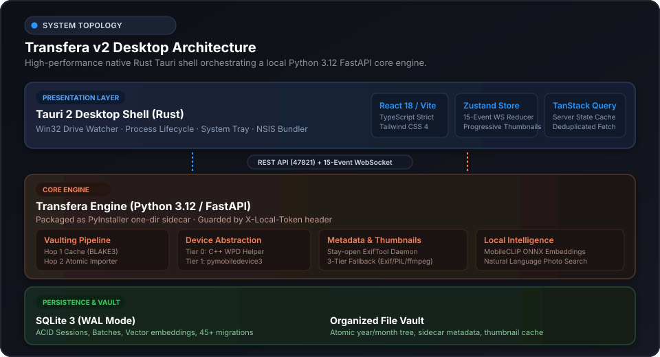
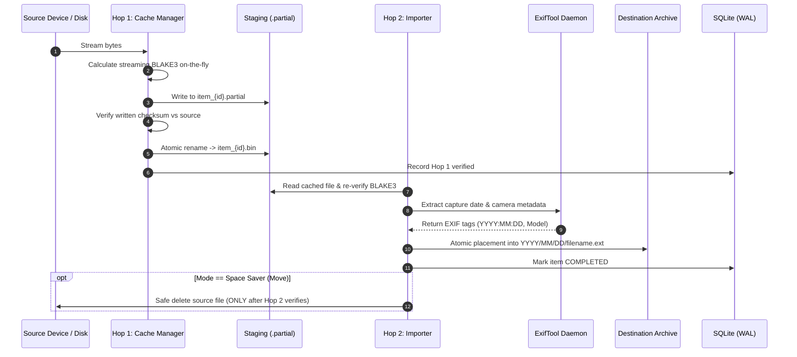
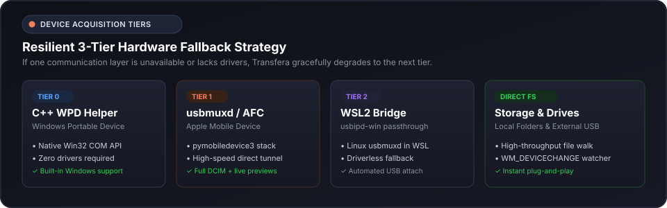
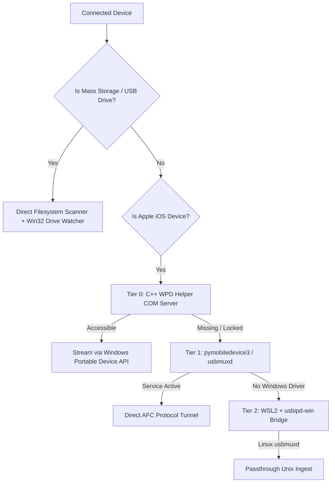

# Transfera Architecture & Inner Workings

Transfera is a high-performance desktop application engineered for verified media vaulting. It transfers and organizes photos and videos from iPhones, cameras, and external drives to your computer with zero cloud dependency and a cryptographic guarantee of byte-level integrity.

---

## 1. System Topology

Transfera pairs a native **Tauri 2** desktop shell with a local, headless **FastAPI / Python 3.12** vault engine. In production, the Python engine is bundled as a self-contained, frozen PyInstaller sidecar (`transfera-engine`) distributed alongside the application.

### Architectural Layers

| Layer | Technology | Responsibilities |
|---|---|---|
| **Presentation** | Tauri 2 (Rust) + React 18 / Vite 6 / TypeScript / Tailwind CSS 4 | Native OS windowing, system tray, Win32 drive plug/unplug watchers, responsive Apple-inspired dark/light UI, close guard modal. |
| **Client State** | Zustand + TanStack Query | Real-time 15-event WebSocket reducer, thumbnail request queueing with negative-cache deduplication, optimistic UI updates. |
| **IPC Bridge** | REST (`127.0.0.1:47821`) + WebSocket | Secure bidirectional communication bound to localhost, authenticated via per-boot 64-character token (`X-Local-Token`). |
| **Core Engine** | FastAPI, Python 3.12 (asyncio) | Batch orchestration, two-hop ingest pipeline, metadata extraction, semantic search, crash recovery. |
| **Native Helpers** | C++ Win32 COM, usbmuxd, ExifTool | Hardware-level WPD acquisition (`wpd_helper.exe`), iOS AFC tunnels, stay-open ExifTool daemon. |
| **Persistence** | SQLite 3 (WAL mode) via SQLAlchemy 2 + aiosqlite | ACID session records, batch state tracking, perceptual hashes, vector search embeddings, migrations. |

---

## 2. The Two-Hop Guarantee

The central guarantee of Transfera is that **no file in your archive can ever be corrupt or partially written**. Instead of copying directly into the destination vault, every file traverses two distinct verified hops:

### Step-by-Step Pipeline Flow

### 1. Pre-Scan & Chunking
- The `scanner` walks the chosen source, extracts basic file stats (size, modification timestamp), and queries the database for existing hashes or duplicates.
- Discovered media items are partitioned into batches of 100 (`BATCH_SIZE = 100`). Batches allow fine-grained progress reporting, bounded memory consumption, and resume checkpoints.

### 2. Hop 1: Ingest & Streaming Hashing
- Media bytes are streamed from the source directly into a `.partial` buffer file in `backend/data/cache/`.
- As bytes flow through the pipeline, a streaming **BLAKE3** hasher computes the cryptographic checksum in real time (with SHA-256 fallback if BLAKE3 is unavailable).
- Once the transfer completes, the calculated hash is validated against the source stream. Only on a verified match is the file atomically renamed to remove the `.partial` suffix.

### 3. Hop 2: Placement & Vault Verification
- Hop 2 reads the cached file, performs a secondary cryptographic verification, and routes the file through the metadata extractor.
- The `organizer` resolves the true creation timestamp (from EXIF headers, QuickTime atoms, or filesystem dates) and determines the final relative path (e.g., `Photos/2026/09-September/IMG_4821.jpg`).
- The file is placed into the destination directory via an **atomic move/rename**.
- In **Space Saver (Move)** mode, the source file is deleted **only after Hop 2 atomic placement and checksum verification succeed**.

---

## 3. Hardware Discovery & Device Tiers

Mobile devices and external storage present unique driver and permission challenges on Windows. Transfera addresses this with a resilient multi-tier fallback architecture:

1. **Tier 0 — C++ WPD Helper (`native/wpd_helper/wpd_helper.exe`)**:
   Communicates directly with the Windows Portable Device COM API. Requires zero third-party drivers or software; works out of the box with standard Windows MTP/PTP subsystems.
2. **Tier 1 — Apple Mobile Device Support (`backend/ios_device.py`)**:
   Connects to the native `usbmuxd` service via `pymobiledevice3`. Provides high-throughput AFC (Apple File Conduit) transfer, battery/device diagnostics, and trust negotiation.
3. **Tier 2 — WSL2 Bridge (`backend/wsl_orchestrator.py`)**:
   If Windows Apple drivers are completely absent, Transfera can automatically bind the device to a WSL2 Linux environment using `usbipd-win`, leveraging Linux `libimobiledevice` and bridging files back to the Windows engine.
4. **Mass Storage & Local Folders**:
   Managed via asynchronous directory walkers and Win32 `WM_DEVICECHANGE` listeners that react immediately to drive insertion and removal.

---

## 4. Subsystems & Intelligence

### Stay-Open ExifTool Daemon
Spawning a Perl runtime for each photo is inefficient. Transfera maintains a persistent, stay-open ExifTool process communicating over standard input/output pipes with the `-stay_open True` protocol. This achieves metadata extraction rates exceeding 300+ items per second.

### Multi-Tier Thumbnail Pipeline
Thumbnails are generated progressively to keep the library and transfer screens smooth:
1. **Embedded EXIF Extraction**: Extracts preview JPEGs embedded in RAW/HEIC files by camera hardware (zero decode cost).
2. **Pillow & pillow-heif**: Decodes full image data with LANCZOS downsampling and EXIF orientation normalization.
3. **ffmpeg**: Extracts video preview frames at a 2.0-second offset.

All thumbnails are stored as 512px JPEG quality 85 assets in `backend/data/cache/thumbnails/` and served over HTTP with permanent `Cache-Control: public, max-age=86400` caching and negative-cache deduplication on the client.

### Local AI Semantic Search
Transfera includes a completely offline, zero-cloud semantic search engine powered by **MobileCLIP** running via ONNX Runtime:
- Generates 512-dimensional normalized embeddings for images.
- Stores vectors in SQLite for cosine-similarity queries.
- Allows natural-language search (e.g., *"beach sunset"*, *"receipt"*, *"dog playing in snow"*) with 100% local privacy.

### Perceptual Hashing & Duplicate Detection
In addition to exact BLAKE3 hash matching, Transfera computes **dHash (difference hash)** fingerprints. If duplicate photos have been re-compressed or slightly modified, the duplicate detector surfaces them with configurable actions (Skip, Keep Both, or Overwrite).

---

## 5. Durability & Crash Recovery

Transfera's durability engine guarantees that sudden power loss, system reboots, or task termination never leave partial or corrupt data:

- **SQLite WAL Mode**: Concurrent readers do not block writers, and writes are recorded to the write-ahead log before committing.
- **Batch State Machine**: Each batch advances through explicit states:
  $$\text{DISCOVERED} \longrightarrow \text{LOADING} \longrightarrow \text{LOADED} \longrightarrow \text{ARCHIVING} \longrightarrow \text{ARCHIVED}$$
- **Boot Recovery (`backend/engines/recovery.py`)**:
  - Automatically sweeps `backend/data/cache/` on startup and deletes orphaned `.partial` files.
  - Inspects any sessions left in `LOADING` or `ARCHIVING` states and resets them to the last verified batch boundary.
  - Ensures resuming an interrupted transfer does not re-copy already vaulted files.
