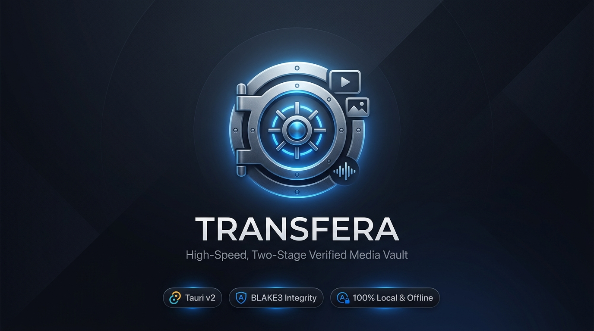

<div align="center">



<br />

# Transfera
### High-Speed, Two-Stage Verified Media Vault for Windows, macOS & Linux

[](https://github.com/R1sh1m/Transfera/actions/workflows/ci.yml)
[](https://github.com/R1sh1m/Transfera/releases)
[](https://tauri.app)
[](https://www.rust-lang.org/)
[](https://www.python.org/)
[](#-how-it-works-the-two-hop-guarantee)
[](#)
[](LICENSE)

<p align="center">
  <b>Transfera</b> is a local-first desktop application engineered to ingest, verify, deduplicate, and organize photos and videos from phones, cameras, SD cards, and USB drives into a pristine archive — with absolute mathematical integrity, zero cloud lock-in, and zero subscriptions.
</p>

[Download Installer](https://github.com/R1sh1m/Transfera/releases/latest) • [Quick Install](#-quick-install) • [Features](#-features) • [How It Works](#-how-it-works-the-two-hop-guarantee) • [Troubleshooting](#-troubleshooting)

</div>

---

## ⚡ Quick Install

Get up and running in seconds:

### Windows (WinGet)
```powershell
winget install Transfera.Transfera
```

### Automated One-Line Installers
<table>
<tr>
<th>🪟 Windows (PowerShell)</th>
<th>🍎 macOS &nbsp;/&nbsp; 🐧 Linux (Bash)</th>
</tr>
<tr>
<td>

```powershell
irm https://raw.githubusercontent.com/R1sh1m/Transfera/main/scripts/Install-Transfera.ps1 | iex
```

</td>
<td>

```bash
curl -fsSL https://raw.githubusercontent.com/R1sh1m/Transfera/main/scripts/install.sh | bash
```

</td>
</tr>
</table>

> [!TIP]
> Prefer standalone binaries? Download the latest standalone `.exe` or `.dmg` directly from [GitHub Releases](https://github.com/R1sh1m/Transfera/releases/latest).

---

## 💡 Why Transfera?

Traditional file explorers and cloud sync utilities drop connections, duplicate files, corrupt partially copied files, or force you into expensive monthly cloud storage. Transfera was built from scratch to solve this:

| Feature | Transfera | Windows Photos / Explorer | Cloud Sync (iCloud / Google) | Manual Drag & Drop |
| :--- | :---: | :---: | :---: | :---: |
| **Integrity Guarantee** | **Two-Stage BLAKE3 Streaming** | ❌ None (Silent bit-rot/drops) | ⚠️ Cloud compression risk | ❌ None |
| **Zero Cloud / Privacy** | **100% Offline & Local** | ⚠️ OneDrive sync prompts | ❌ Requires Cloud / Subscription | ✅ Local |
| **iPhone & iPad Ingestion** | **Native WPD / USB (No iTunes)** | ⚠️ Frequent lockups & disconnects| ❌ Requires app sync / bandwidth | ⚠️ Unreliable Explorer MTP |
| **Smart Deduplication** | **Perceptual + Exact Cryptographic**| ❌ None | ⚠️ Cloud-only duplicates | ❌ Overwrites or duplicates |
| **Crash-Resilient Staging**| **Atomic Staging (`.partial`)** | ❌ Leaves corrupt half-files | ⚠️ Incomplete background sync | ❌ Corrupt partial files |
| **Metadata Preservation** | **ExifTool Stay-Open Worker** | ⚠️ Often strips/modifies EXIF | ⚠️ Strips GPS/metadata on sync | ⚠️ Fragile filesystem timestamps |
| **On-Device Semantic Search** | **Local MobileCLIP AI (No Cloud)** | ❌ None | ⚠️ Server-side facial & data scans| ❌ None |

---

## ✨ Features

- **🛡️ Two-Hop Mathematical Integrity**  
  Every file streams through a real-time BLAKE3 cryptographic hash during transfer into temporary `.partial` storage, then re-verifies prior to atomic placement. Corrupted transfers are physically impossible.
- **⚡ Native Hardware Ingestion**  
  Plug in your iPhone, iPad, camera, or USB SD card. Direct hardware helpers detect media instantly without iTunes or third-party drivers.
- **🔍 Smart Deduplication**  
  Eliminate duplicate shots and duplicate imports across devices using byte-level cryptographic hashes and perceptual image similarity matching.
- **📁 Automatic Chronological Archiving**  
  Deep EXIF extraction extracts actual capture timestamps from photo and video streams to organize your archive into clean, predictable directories (`Photos/YYYY/MM-Month/IMG_XXXX.jpg`).
- **🧠 On-Device Semantic AI Search**  
  Find "sunset on the beach", "birthday celebration", or "documents" across your entire photo vault using local, CPU-optimized MobileCLIP neural embeddings. Zero data leaves your machine.
- **🔒 Non-Destructive Ingestion**  
  Default **Backup (Copy)** mode guarantees your source device is strictly read-only. Switch to **Space Saver (Move)** only when you choose to safely reclaim device space after full cryptographic verification.

---

## 🔬 How It Works: The Two-Hop Guarantee

Transfera eliminates file corruption, aborted transfers, and orphaned partial writes through its two-stage ingestion pipeline:

```
[ Camera / iPhone / SD Card / Folder ]
                  │
                  ▼  (Hop 1: Ingestion & Streaming BLAKE3 Hashing)
        [ Cache: .partial file ]
                  │
       Cryptographic Hash Match?
            ├── YES ──► (Hop 2: Verification & Atomic Rename)
            │                  │
            │                  ▼
            │        [ Final Vault: YYYY/MM/DD/filename.jpg ]
            │
            └── NO  ──► Abort & alert user (Zero partial/corrupted files placed)
```

1. **Hop 1 (Ingest & Hash)**: As bytes stream from the device, a BLAKE3 streaming hasher computes the checksum concurrently with disk writing. Files are held with a `.partial` extension.
2. **Hop 2 (Atomic Placement)**: The file is verified against its manifest, thumbnails are generated in the background, EXIF metadata is parsed, and an atomic filesystem move safely deposits the file into your organized archive.

---

## 📸 Your First Backup

1. **Open Transfera** — launch the app to the **Dashboard**.
2. Click **Start New Backup** (or **Setup** in the navigation bar).
3. **Select Source**:
   - *Connected Devices (iPhone / iPad):* Connect via USB, unlock your device, tap **Trust**, and select it in the device picker.
   - *This PC / External Drives / SD Cards:* Click **Browse** and pick the source folder.
4. **Select Destination**:
   - Choose your external hard drive, NAS mount, or local photo folder (e.g., `D:\MediaVault` or `~/Photos`).
5. **Choose Mode**:
   - **Backup (Copy)**: Keeps source files intact (recommended).
   - **Space Saver (Move)**: Safely removes source files only after verified vaulting.
6. **Start Ingestion**:
   - Monitor real-time transfer speeds, hashing rates, and live thumbnail previews.
7. **Explore Your Library**:
   - Filter by date, inspect metadata, locate duplicates, or run local natural language search queries.

---

## 🛠️ Build From Source

### Prerequisites
- **Python**: 3.12+
- **Node.js**: 20+
- **Rust**: Latest stable (`rustc`, `cargo`)
- **C++ Compiler**: MSVC (Windows Build Tools) / Clang (macOS) / GCC (Linux)

### Development Setup

```bash
# 1. Clone repository
git clone https://github.com/R1sh1m/Transfera.git
cd Transfera

# 2. Run bootstrapping script
python run.py
```

`run.py` automatically sets up the Python virtual environment (`.venv`), installs dependencies, compiles native helpers, and launches the Tauri v2 desktop shell with Vite HMR.

---

## 🔧 Troubleshooting

| Symptom | Resolution |
| :--- | :--- |
| **iPhone not appearing in device list** | Use an authentic data-capable USB cable (not charge-only), unlock the screen, tap **Trust This Computer**, and reconnect. Verify the Apple Mobile Device Support service is active. |
| **"Duplicates Found" dialog pauses transfer** | Review the flagged items in the duplicate resolution dialog. Select **Skip**, **Keep Both**, or **Overwrite**, then click **Resume**. |
| **AI search returns no results** | Semantic search requires the local ONNX MobileCLIP weights. Open **Library** → click **Get AI Models** (~200MB download once) → click **Index Library**. |
| **Antivirus alert during installation** | Locally compiled native helpers (`wpd_helper.exe`) and sidecar binaries can trigger heuristic false-positives. Add your Transfera installation directory to your antivirus exclusions. |
| **Need support or found a bug?** | Export application logs from `backend/data/logs/transfera.log` and open an issue on our [Issue Tracker](https://github.com/R1sh1m/Transfera/issues). |

---

## 📄 License

Distributed under the **GNU Affero General Public License v3.0 or later** (AGPL-3.0-or-later). See [LICENSE](LICENSE) for details.

Transfera is free for personal, academic, and commercial use. If you modify or re-host Transfera, maintain the copyright notice, state all changes, and publish modifications under the same license terms.

*Copyright © 2026 Rishi Misra. All rights reserved.*
