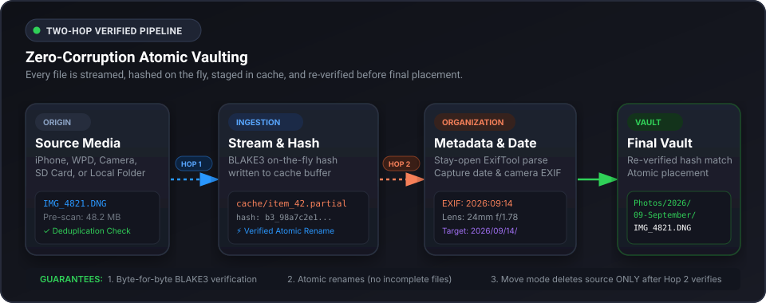

<div align="center">

```text
█████████████████████████████████████████████████████████████████████████████████████████████
█        ██       ██████  █████  ███████  ███      ███        ██        ██       ██████  ████
████  █████  ████  ████    ████   ██████  ██  ████  ██  ████████  ████████  ████  ████    ███
████  █████  ████  ███  ██  ███    █████  ██  ████  ██  ████████  ████████  ████  ███  ██  ██
████  █████  ███   ██  ████  ██  ██  ███  ███  ███████  ████████  ████████  ███   ██  ████  █
████  █████      ████  ████  ██  ███  ██  █████  █████      ████      ████      ████  ████  █
████  █████  ████  ██        ██  ████  █  ███████  ███  ████████  ████████  ████  ██        █
████  █████  ████  ██  ████  ██  █████    ██  ████  ██  ████████  ████████  ████  ██  ████  █
████  █████  ████  ██  ████  ██  ██████   ██  ████  ██  ████████  ████████  ████  ██  ████  █
████  █████  ████  ██  ████  ██  ███████  ███      ███  ████████        ██  ████  ██  ████  █
█████████████████████████████████████████████████████████████████████████████████████████████
```

**Your photos & videos on your machine**

Transfera moves photos and videos off your phone, camera, or USB drive into a verified local archive — hashed on the way in, re-verified before anything lands, filed by date automatically. Ensuring that your data is safely transferred and available for you to access anytime.

[](https://github.com/R1sh1m/Transfera/actions/workflows/ci.yml)
[](https://www.python.org/downloads/)
[](https://nodejs.org/)
[](LICENSE)
[](#-install)

</div>

---

## Why Transfera

- **Verified end to end** — every file is hashed while copying, then hashed again before it enters your archive. Anything that fails verification never lands.
- **Organized automatically** — photos file into `2026/09-September/`, documents into `Documents/<Kind>/` date folders.
- **iPhone & iPad, no iTunes** — plug in, unlock, tap Trust. Tiered access (direct, helper, bridge) degrades gracefully instead of failing outright.
- **Find anything instantly** — on-device AI search ("sunset beach") with keyword fallback, plus duplicates, faces, trash, and timeline.
- **Survives crashes and restarts** — interrupted transfers resume where they stopped; partial files never pollute your archive. If the engine ever fails to start, the app tells you and recovers on its own once it's back.
- **Private by architecture** — everything runs on localhost. The network is used once, only to fetch helper tools.

---

## Installation

Copy-paste the relevant **block** for your platform.

<table>
<tr>
<th>🍎 macOS &nbsp;/&nbsp; 🐧 Linux</th>
<th>🪟 Windows</th>
</tr>
<tr>
<td>

```bash
[ -d Transfera ] || git clone --depth 1 https://github.com/R1sh1m/Transfera.git Transfera
cd Transfera
bash scripts/install.sh
```

</td>
<td>

```powershell
if (-not (Get-Command git -ErrorAction SilentlyContinue)) { Write-Warning "git not found" }
if (-not (Test-Path .\Transfera)) { git clone --depth 1 https://github.com/R1sh1m/Transfera.git .\Transfera }
cd .\Transfera
powershell -ExecutionPolicy Bypass -File .\scripts\Install-Transfera.ps1
```

</td>    
</tr>
</table>

First run takes 5–15 minutes (downloads + build).

#### Optional flags (both scripts)

| Flag | Effect |
|---|---|
| `--skip-driver` | Skip Apple device support install |
| `--skip-native` | Skip C++ helper build (folder backup still works) |
| `--yes` | Non-interactive — assume yes to all prompts |

**Windows only:** add `-Silent` to run the produced installer with zero click-through.

---

## 📸 Your first backup

1. **Open Transfera** — you land on the **Dashboard**.
2. Hit **Start New Backup** (or **Setup** in the sidebar).
3. **Source** — where are your photos?
   - *This PC / external drive:* click **Browse**, pick the folder, preview the grid, tick what you want.
   - *iPhone / iPad:* plug in via USB, unlock, tap **Trust** on the phone. It appears under **Connected devices** instantly.
4. **Destination** — click **Browse**, pick or create your archive folder (e.g., `D:\Photos` or `~/Photos`).
5. **Mode** — leave it on **Backup (Copy)**. Your originals are never touched. Switch to **Space Saver (Move)** only if you want originals deleted after a verified copy.
6. Press **Start**. Watch live progress, speeds, and thumbnails on the **Transfer** page.
7. Open **Library** — searchable by date, content (AI), duplicates, trash, and more.

---

## 🏛️ Architecture & Verification

Every file transferred by Transfera travels through a two-stage verified vaulting pipeline. Streaming BLAKE3 hashes are calculated on-the-fly and validated at every hop before atomic placement into your archive, guaranteeing zero byte corruption and safe space-saver moves.

<p align="center">
  
</p>

For a deeper dive see the full **[Architecture Specification](ARCHITECTURE.md)**.

---

## 🔧 Troubleshooting

Most engine problems resolve themselves, some common situations are listed:

| What you see | What to do |
|---|---|
| Engine Unavailable | Usually transient — the screen clears on its own once the engine answers. If it persists, click **Retry**. |
| iPhone not listed | Use a data cable (not charge-only), unlock, tap **Trust**, unplug and replug. The Device Setup page walks through driver states. |
| "duplicates found" paused | Open the popup → **Skip**, **Keep both**, or **Overwrite** → Resume. |
| Search finds nothing | Default is filename-only. Press **Get AI models** in Library, wait for the ready state, press **Index library**, search again. |

---

## License

**AGPL-3.0-or-later** — see [LICENSE](LICENSE).  

